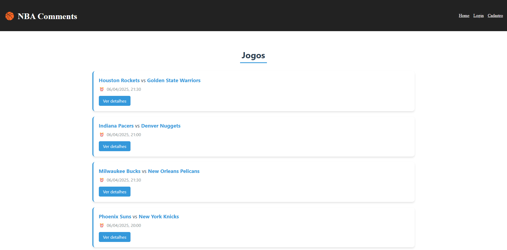
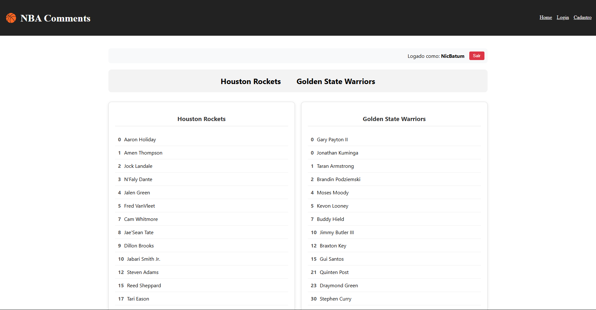
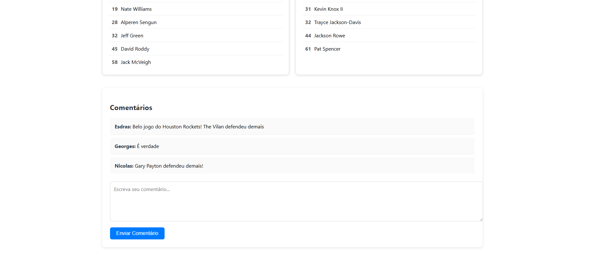
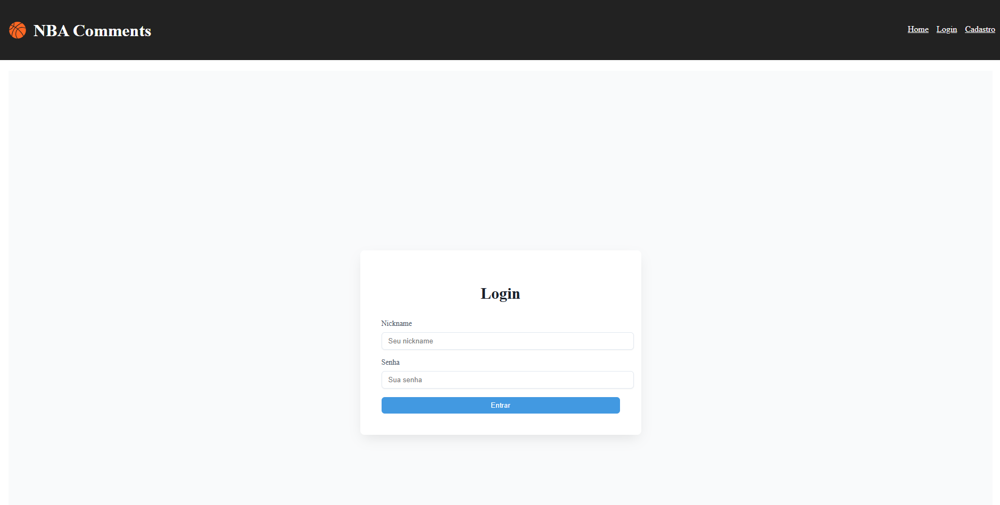
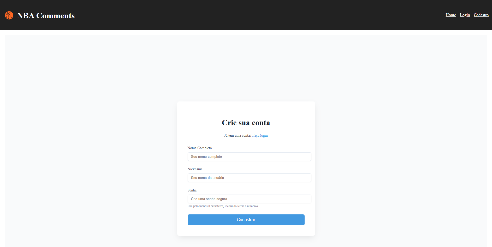

# CSI606-2024-02 - Remoto - Proposta de Trabalho Final

## Discente: Esdras Almeida Ávila

## Resumo
**NBA Comments** é uma plataforma destinada aos fãs da Liga Nacional de Basquete dos Estados Unidos (NBA) que desejam interagir com outros usuários. Além de exibir os placares atualizados, a plataforma oferece uma área separada para que os usuários possam comentar, compartilhar opiniões e discutir sobre os jogos e jogadores da liga. O site possui funcionalidades de pesquisa de times, comentários de jogos e destaque do jogo. 

## 1. Tema
O trabalho final tem como tema o desenvolvimento de um site de comentários do basquete da NBA.
## 2. Escopo
Este projeto terá as seguintes funcionalidades: 

**Login:** usuário insere seu nome de usuário, nickname,e senha.

**Cadastro:** usuário insere seu nome de usuário, nickname,e senha.

**Comentários nos Jogos:** A plataforma oferece uma área interativa onde os usuários podem comentar sobre os jogos em andamento, compartilhar suas opiniões, análises e debater com outros fãs da NBA. A seção de comentários é organizada por jogo, permitindo discussões focadas nos eventos específicos de cada partida.

## 3. Restrições
Neste trabalho não serão considerados:

- Pesquisas individuais dos times

## 4. Protótipo
Os protótipos das principais telas do sistema foram desenvolvidos:
- Página inicial: Visualização dos jogos que acontecem e acontecerão no dia;

    

---
- Página do jogo: Mais detalhes do jogo e comentários poderão ser vistos;

    
    
---
- Login 

    

---
- Cadastro
  
    

